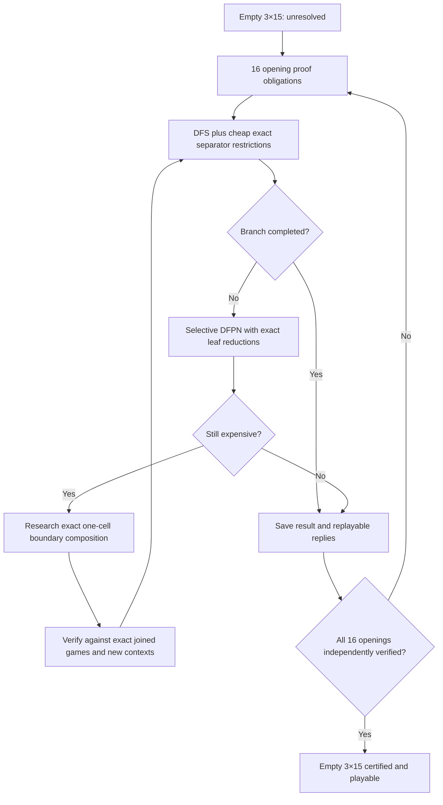

# A measured route toward solving empty 3×15 Col

Investigation: September 4, 2026, local development host.

**Empty 3×15 is not solved by this investigation.** We implemented and tested
an exact separator restriction bound, found a 29% reduction in the completed
3×13 search, and identified a workload where a hybrid depth-first proof-number
prototype completes a difficult 3×15 position. These are useful ingredients,
not evidence of an order-of-magnitude improvement on the empty board.

## What the target actually requires

To certify P2 wins on the empty 3×15 board, all 16 symmetry-distinct P1 openings
must be refuted. At each P2 turn, one winning reply is enough; after that reply,
every legal P1 continuation must be covered. A completed arbitrary position
does not certify the empty board. In particular, the three-stone position below
is a stress test, not a proved unique bottleneck or a necessarily forced line:

```text
B.............B
...............
..............W
P2 to move
```

The four-corner child obtained by adding W at the lower-left corner is called
Q15 here. Its first-player-win result refutes that particular P2 reply.

## The mathematical intuition that survived testing

The production solver is already good at disconnected games:

```text
large component + small exact game value
```

The hard cases frequently look instead like:

```text
left region ── one or two boundary cells ── right region + small value
```

We must preserve the effect of those boundary cells. Deleting them outright or
adding independently computed win/loss outcomes is not a sound game reduction.
There is, however, a simple **one-sided bound** that avoids this problem:

1. Remove some legal moves from the current player, without consuming a turn.
   If that handicapped player still wins, they also win in the original game.
2. Remove some legal moves from the opponent. If the current player still loses
   against the weakened opponent, they also lose in the original game.
3. Otherwise the test is inconclusive; resume exact search.

The modified player can only have fewer available strategies. An original
winning strategy in the harder game remains legal when that player's omitted
moves are restored; it simply ignores the extra options. For the losing bound,
a winning strategy for the weakened opponent remains available to the original
opponent. Subsequent move updates preserve the corresponding mask inclusions.

Our prototype tries removing **one player's** permissions on a column, then
checks whether all resulting interaction components contain at most 10 cells.
If so, the existing exact CGT evaluator determines the modified game's outcome.
Only the two implications above may terminate the original search. It never
treats arbitrary boundary deletion as equality, changes turns, or labels an
inconclusive test a loss.

### Completed benchmark

Same isolated binary, one thread, fixed 2^24-slot board table (256 MiB for slots),
legacy move order, cutoff 10, cold evaluator, no saved tablebase:

| Empty 3×13 | Counted DFS states | Time | Result |
|---|---:|---:|---|
| DFS | 7,260,687 | 9.79 s | P2 win |
| DFS plus separator restriction bounds | 5,144,039 | 9.16 s | P2 win |

The reduction is **29.15% fewer counted states**, or 1.41× less search work.
The new bound fired 655,768 times. These are single development-host timing
screens: the roughly 6% wall-clock difference is not a robust performance claim.
Testing columns and evaluating modified positions adds substantial per-state
work. The next engineering task is to reduce that overhead, then evaluate the
effect on completed 3×15 subproblems.

Validation includes all 8,192 combinations of two legality masks and turn on
3×2 against the existing exact evaluator, 32,768 independent plain-recursion
monotonicity checks, and agreement of four search modes on 24 legal positions
with both winning and losing outcomes. These tests supplement the argument;
they are not an all-width formal proof.

## What the profile actually says

A 5-million-state, fixed-memory run sampled every 64th completed recursive
return and retained every completed recursive subtree costing at least 100
counted states. These are **raw, pre-reduction shadow states** on one search
prefix. Parent and child costs overlap, and unfinished subtrees are excluded.
Therefore the frequencies below are not percentages of the whole root's
runtime, and are not evidence that the entire empty-board search has this mix.

Among 1,448 two-component observations costing at least 1,000 counted states:

| Observation | Result |
|---|---:|
| Unique geometric pairs | 1,417 |
| Unique geometric large cores | 1,367 |
| Keys after exact small-value normalization | 1,378 |
| One-cell column separator | 533 (36.8%) |
| Two-cell column separator | 842 (58.1%) |
| Three-cell column separator | 73 (5.0%) |
| Large core is a tree | 0 |

A separator qualifies when deleting its cells leaves at least two regions of
four or more cells each. A width-three separator is expected on a height-three
strip; the useful finding is that 95% of these expensive observations need only
one or two cells. This is structural prevalence, not a certified reduction rate.

Stripping the tiny component produces only about 5.6% repeated core observations
in this group. Exact small-value normalization collapses unique pair keys by
only 2.75%. The larger >=100-state group yields a 6.73% key reduction. These
figures do not support the earlier hypothesis of 50%+ expensive-core reuse.
An exact colored-tree graph-isomorphism analysis found no additional collapse
in the expensive groups; tree canonicalization is not the priority here.

A second 3-million-state profile after the alternative P2 reply at zero-based
cell 2 produced 725 >=1,000-state two-component observations. Of these, 679
(93.7%) had a one- or two-cell column separator, 44 needed three cells, and two
had no qualifying column cut. There were 706 unique large cores and only four
fewer normalized-charge keys than geometric pairs (716 → 712). This supports
the same direction on another branch, while still not measuring the whole root.

## Search experiments: keep the distinctions

The first hybrid DFPN prototype uses 128-state exact DFS leaf probes and a
separate proof/disproof table. It retains existing exact DFS reductions inside
leaf probes. Unknown leaves remain unknown. Counted DFS states and DFPN
expansions are separate and their sum controls the state budget.

| Workload | DFS | DFPN prototype | Interpretation |
|---|---|---|---|
| Empty 3×9 | 14,487 states; completed | 194,259 DFS states; completed | Strong regression |
| Empty 3×11 | 819,417 states; completed | 17,567,847 DFS states; completed | Strong regression |
| Empty 3×13, 2^20 slots | 6,757,066 states; completed | Unresolved at 30M combined budget | Reject as default |
| Three-stone 3×15, 30M budget | Unresolved | Unresolved | No win demonstrated |
| Q15, P1 to move | Did not finish within 100 seconds | P1 win; 41,111,376 DFS states + 359,673 expansions; 64.81 s | Useful targeted result |

The Q15 runs had an intended 120M-state cap and a 100-second external limit.
The killed DFS run has no final counters; do not turn that timeout into an exact
state ratio or claim the prototype is universally faster. Prior August records
reported a completed 92.9M-state DFS solve of Q15, but they are not a same-build
paired comparison with this investigation.

The longer DFPN screen on the original three-stone position remained unresolved
when stopped at 180 seconds. The intended cap was 120M combined states, but the
external timeout occurred before final counters were emitted. The Q15 result
therefore has **not** translated into a completed proof of its parent.

Other screens:

- Refusing low-priority incoming board-cache entries made empty 3×13 grow from
  6.76M to 23.88M states at 2^20 slots. Reject this admission rule. Fewer evictions
  alone do not establish less recomputation or faster completed solving.
- Skipping board-cache entries below 12 live cells increased throughput on a
  fixed 30M-state prefix, but did not solve the three-stone position. This does
  not establish a smaller completed search.
- The existing one-large-component native-search mode timed out after 100 s
  on the three-stone position. Its internal native states are not covered by
  our outer DFS state counter, so only the external timeout is comparable.
- Sorting moves by the sizes of the remaining components, with either a
  20-cell or a 26-cell activation threshold, failed to finish empty 3×13 within
  15M states while ordinary DFS finished in 7.26M. Easy-looking fragments alone
  are not a reliable winning-move policy.
- The new separator bound also left the three-stone position unresolved at
  15M counted states; it fired 1,893,945 times but took about 33.8 s versus
  17.1 s for the ordinary DFS prefix. Equal counted states do not mean equal
  mathematical progress, so this is evidence of high checking overhead, not a
  measured completed-search regression or improvement on that position.
- Q15 with the separator prototype did not complete within a separate
  100-second external limit (intended 60M counted-state cap). No final counters
  were emitted. That screen and the long DFPN screen partly overlapped; neither
  is a controlled timing comparison.

## Existing mechanisms that should not be proposed as new

The local checkout already has exact small-component number-plus-star charges
in component-bag keys, shared caches, persistence plumbing, dominance, reserve
bounds, and an opt-in one-large-component transition engine. The last engine
currently requires a large component of at most 2×cutoff+2 = 22 cells. That
restriction ensures descendants have at most one still-oversized component;
removing the restriction requires a representation for multiple large components.

It is reasonable to improve or selectively activate these systems, but “add
small-component algebra” or “add component caching” is not a new answer.

## Recommended implementation order and acceptance gates

### 1. Turn separator restrictions into cheap exact cutoffs

Retain the proved one-sided rule. Reuse component discovery already performed
by the reducer, inspect only columns touching an oversized component, cache
modified local values, and stop tests that cannot leave evaluable components.
Choose gates from measured total cost, not raw certificate hit counts.

Acceptance: unchanged outcomes, a repeated wall-clock win on completed boards,
and a substantial reduction on completed hard 3×15 children. The present 29%
3×13 reduction is a useful starting point, not the required 10× breakthrough.

### 2. Use a search portfolio on genuinely hard branches

Keep DFS for ordinary work. Use resumable DFPN on branches where bounded DFS
does not finish, with the same exact cutoffs in both. Test multiple leaf-probe
budgets. Use completed hard branches, proof progress, total work, and peak
memory to select the search, rather than picking whichever visits more nodes
per second. Share only completed outcomes between engines unless partial-proof
metadata has a separately verified meaning.

Acceptance: solve more held-out hard children at equal CPU/memory budgets.
Q15 is a positive example, not sufficient validation for replacing DFS.

### 3. Develop exact one-cell boundary composition

For cases where one-sided bounds are inconclusive, prototype an **open game**
for each side of a single boundary cell. It must retain internal move options,
effects on the shared cell's legal permissions, and the joint effect when
either player occupies that cell. Combine the two open games; once the boundary
dies, use ordinary CGT addition.

Four legality states of one cell (or 64 for three cells) are only the raw
boundary alphabet. They are not a proof that four/64 win-loss labels summarize
all future play. Players may delay using the boundary and alternate between
regions. A proposed compression must preserve those options and be checked
against exact small joined games, including counterexample searches with new
contexts. Equal finite test outcomes alone do not justify a rewrite.

Start with the 533 one-cell cases above. Measure the number of distinct exact
open-game objects and the cost of composition before tackling two-cell cuts.
Acceptance: provably equivalent replacement and a measured large reduction on
held-out complete subproblems. A 5–10× reduction is an engineering target, not
an estimate of what this method will deliver.

### 4. Complete an auditable empty-board solve

Persist each opening's proved result and a replayable response strategy, plus
exact solved component knowledge. Schedule/resume unresolved work without
discarding completed proof obligations. Cap both the board table and the
component/proof stores; a fixed board TT alone is not a total memory cap.

Finish all 16 opening obligations and independently replay the resulting
strategy. “Millions of visits,” a corpus, or one completed child is not this
milestone. Only then report empty 3×15 solved and integrate its strategy into
the explorer. A finite 3×15 proof still does not establish all odd widths.

## What brute force would require

Time is total search work divided by sustained throughput. We do not yet know
the total work for a completed empty 3×15 solve; bounded prefixes cannot supply
it. At an illustrative 1 million visits/s, 1B / 10B / 100B visits take about
17 min / 2.8 h / 28 h. A 10× throughput improvement divides those times by ten,
but cannot tell us which row applies. These are arithmetic scenarios, not
runtime predictions.

Do not extrapolate small-board parallel scaling to 3×15 without measurement,
and do not buy a large-memory run based solely on fewer TT evictions. CPU and
memory tuning remain useful after the search representation and scheduling
show progress on completed hard work.

## Sources and reproducibility

The experiments ran on a development machine, and some screens overlapped
compilation or profile analysis. Use the deterministic completed-work counts
and correctness outcomes for strong conclusions. Repeat isolated paired runs
before making wall-clock performance claims; these are not publishable timing
benchmarks. We did not collect total peak RSS for this investigation.

- [Uiterwijk, 2022: rectangular Col and Snort](https://cris.maastrichtuniversity.nl/en/publications/solving-bicoloring-graph-games-on-rectangular-boards-part-1-parti/): even-dimension strategy, linear Col proof, and the absence of an odd×odd strategy in that paper. It does not prove our new separator bound or describe current project results.
- [Kishimoto et al., 2012: proof-number-search survey](https://journals.sagepub.com/doi/10.3233/ICG-2012-35302): algorithmic background; not a performance guarantee for Col.
- [Müller's DFPN publications](https://webdocs.cs.ualberta.ca/~mmueller/dfpn.html) and [IJCAI 2022](https://www.ijcai.org/proceedings/2022/0658.pdf): DAG completeness and the distinction between tree and graph proof-number behavior. Col strictly loses legal cells on every move, so its actual position graph is acyclic; graph transpositions can still distort effort estimates.
- `screens.json`, `followup.json`: commands, results, counters, timeouts.
- `demon-profile.tsv`, `demon-profile.summary.json`: raw observations and derived counts.
- `validation.json`: independent small-position checks.
- `reply2-profile.tsv`, `reply2-profile.summary.json`: the second search-prefix profile.
- `v1-source.zip`, `v2-source.zip`, `provenance.json`: exact isolated source
  snapshots, manifests, and binary/source hashes. V1 generated `screens.json`;
  V2 generated `followup.json` and the separator tests.

To reproduce a snapshot, unpack it into its own directory and run:

```sh
cargo build --release --offline --bin research
cargo test --release --offline --lib research_tests
```

The saved JSON command arrays specify all positional arguments. Replace the
binary path with the newly built `target/release/research`. Rust dependencies
must be available in the local Cargo cache for `--offline`; the manifest and
lockfile are included. The current `scripts/prepare_3x15_research.py` can also
create a fresh V2-style experimental copy of the current production sources.



Research copies were built outside the production source tree. No production
search defaults were changed. Existing uncommitted work was preserved.
